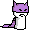
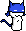
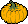

<h1 align="center" style="font-family: 'Courier New';">
    <b>
        
        </b>
    
    
    
     
    
    
    
</h1>

Pesterchum is an instant messaging client copying the look and feel of clients from Andrew Hussie's webcomic Homestuck.

Contributions in any form are very welcome!! Including for extra themes, bug fixes, features, etc. Just hmu in the support server or make a pull request :3

There's a [Russian translation of this repository](https://github.com/Daosp/pesterchum-Dpeta-rus/releases) available, it's somewhat outdated though.

This repository is a maintained version of [ghostDunk's Pesterchum](https://github.com/illuminatedwax/pesterchum/), originally forked from <a href= "https://github.com/karxi/pesterchum">pesterchum-karxi</a> + [Hydrothermal](https://github.com/Hydrothermal)'s fix of the "YOUR NICK IS BEING CHANGED TO X" msgbox-spam exploit.

## MAIN CHANGES 
 - Updated dependencies; [Python 2 --> Python 3](https://www.python.org/doc/sunset-python-2/), [Qt4 --> Qt5 & Qt6](https://www.qt.io/blog/2014/11/27/qt-4-8-x-support-to-be-extended-for-another-year)
 - Basic GUI for choosing a server
 - Client --> Server encrypted connection via [TLS/SSL](https://en.wikipedia.org/wiki/Transport_Layer_Security) 
 - UTF-8 encoded text, emojis 😿💀😱 work and so do non-western characters that weren't supported with ascii
 - Get moods (and color) privately via metadata (IRCv3 draft), previously any IRC user could see who you were messaging since it would send out a public GETMOOD request
 - Tentative support for communicating color and timeline via [IRCv3 Message Tags/TAGMSG](https://ircv3.net/specs/extensions/message-tags#the-tagmsg-tag-only-message)
 - More options for quirks: <a href="quirks/gradient.py">build-in gradient function</a>, <a href="CHANGELOG.md#v231---2022-06-23"> exclude smilies/links</a> (https://github.com/Dpeta/pesterchum-alt-servers/issues/35)
 - Funky [win95-theme](https://www.pesterchum.xyz/img/win95.png) by [cubicSimulation](https://twitter.com/cubicSimulation) 
 - Works better with high resolutions since size scales via Qt's [high DPI scaling](https://doc.qt.io/qt-6/highdpi.html) (https://github.com/Dpeta/pesterchum-alt-servers/issues/66)
 - Usable with Wayland on Linux, it used to break because of the way Pesterchum set its window position
 - Excecutables build with PyInstaller, allows for a smaller release filesize + dlls can be include with the binary
 - Lots of fixes for miscellaneous crashes/issues. . . check out the <a href="CHANGELOG.md">CHANGELOG</a>! :3

[CHANGELOG.md]: https://github.com/Dpeta/pesterchum-alt-servers/blob/main/CHANGELOG.md
[TODO.md]: https://github.com/Dpeta/pesterchum-alt-servers/blob/main/TODO.md

## INSTALLATION 

1. Download the appropriate release for your platform and architecture from [releases][releases].
2. Extract the zip file.
3. Run the executable:

    - For Windows, run ``pesterchum.exe``, this may show up as just "pesterchum" if you have file extensions set to hidden.
        - Newer releases won't run on Windows XP/Vista since Python stopped supporting it.

    - For Linux, run ``Pesterchum``.
        - Linux releases are not backwards compatible with glibc versions older than the one it was build against. The glibc version the release was build against will be included in the filename, like: *PesterchumAlt.-2.2-linux64-**glibc2.27**.tar.gz*. This really shouldn't be an issue unless your distro is absolutely ancient, if it is, run from source.
        
    - For macOS, run the ``Pesterchum.app`` app file, this may show up as just "Pesterchum" if you have file extensions set to hidden. Alternatively, run the binary directly from ``Pesterchum\Pesterchum.app\Contents\MacOS\Pesterchum``.
        - macOS releases require at least 10.14 (Mojave) or older and a 64 bit processor.
        - My releases are unsigned, so you'll probably have to click ["Open Anyway"](https://support.apple.com/guide/mac-help/open-a-mac-app-from-an-unidentified-developer-mh40616/mac).
 
[releases]: https://github.com/Dpeta/pesterchum-alt-servers/releases

## DOCUMENTATION 

The old documentation can be found in [docs](docs), these have aged pretty well:
 - <a href="docs/themes.txt">HOW TO MAKE YOUR OWN THEME</a>
 - <a href="docs/trollquirks.mkdn">Canon troll quirk guide (REGEXP REPLACE)</a>
 - <a href="docs/PYQUIRKS.mkdn">Guide for setting up Python quirk functions</a>

I've been adding some info to [the wiki](https://github.com/Dpeta/pesterchum-alt-servers/wiki), the available pages as of me updating this readme are:
 - [Handle registration and ownership (nickServ)](https://github.com/Dpeta/pesterchum-alt-servers/wiki/Handle-registration-and-ownership)
 - [Memo registration and ownership (chanServ)](https://github.com/Dpeta/pesterchum-alt-servers/wiki/Memo-registration-and-ownership)

Some useful off-repo guides:
 - [How to register your handle with nickServ](https://squidmaid.tumblr.com/post/67595522089/how-to-register-your-pesterchum-handle-the-actual)
 - [Collection of gradient quirk function guides](https://paste.0xfc.de/?e60df5a155e93583#AmcgN9cRnCcBycmVMvw6KJ1YLKPXGbaSzZLbgAhoNCQD
)

The old READMEs are also preserved in the [docs](docs) folder:
- <a href="docs/README-pesterchum.mkdn"> illuminatedWax's README</a>
- <a href="docs/README-karxi.mkdn "> karxi's README</a>
- <a href="docs/TODO.mkdn "> karxi's TODO</a>
- <a href="docs/CHANGELOG-karxi.mkdn "> karxi's CHANGELOG</a>

## RUNNING FROM SOURCE 
Pesterchum is a Python script. This means that as long as you have Python installed you can run it without requiring a build/executable, this is useful if there's no compatible build for your system.

### DEPENDENCIES
 - [Python 3]
     - Ideally 3.8 or later, though older versions may still work, I don't test them.
 - [PyQt6] (prefered) or [PyQt5] (legacy)
     - Qt6 only supports maintained 64 bit operating systems, like Windows 10 or later for Windows. ([Qt 6.3 Supported Platforms](https://doc.qt.io/qt-6/supported-platforms.html))
     - Qt5 supports Windows 7 or later, but is past its EOL for non-commercial use. ([Qt 5.15 Supported Platforms](https://doc.qt.io/qt-6/supported-platforms.html))
 - (Optional) [pygame-ce] or [pygame] can provide an alternative audio backend for certain systems.
     - Useful for Linux systems that don't meet the Qt6 requirements, as Qt5 Multimedia has a GStreamer dependency.
 - (Optional) [certifi] can provide alternative root certificates for TLS certificate validation.
     - Useful for MacOS, as Python doesn't use the system-provided certificates because of MacOS' outdated SSL library. Also miscellaneous systems without usable root certificates.
 - (Optional) [libseccomp] and its Python bindings on Linux let Pesterchum apply seccomp-bpf restrictions on itself.
    - Packages on Arch: ``libseccomp python-libseccomp``
    - Packages on Debian: ``libseccomp2 python-seccomp``
 
### WALKTHROUGH

1. Verify you have [Python 3] and [pip] installed by running ``python --version`` and ``python -m pip --version`` on your system's console/terminal. If not, [install Python](https://www.python.org/downloads/), make sure to check to include pip and "Add to path" in the installer. If you have Python 3 but not pip, you could use [get-pip](https://github.com/pypa/get-pip).
    - On Windows, depending on your installation, Python 3 might be available with the ``py -3`` command instead of ``python``.
    - Some platforms, mostly Linux and macOS, might require you to run ``python3`` instead of ``python``. Some old installations still have Python 2 available under ``python``.
    - On Linux it's better to install Python & pip via your package manager.
    - On macOS it's also possible to install (a more recent version of) Python via [Brew](https://brew.sh/).
2. Install Pesterchum's dependencies with pip, run: ``python -m pip install -r requirements.txt``
    - If this fails, try running ``python -m pip install -U pip setuptools wheel`` to update pip, setuptools & wheel and then trying again.
    - Alternatively, many linux distros also have packages for pyqt and pygame.
        - Debian: [python3-pyqt6](https://packages.debian.org/testing/python/python3-pyqt6), [python3-pygame](https://packages.debian.org/testing/python/python3-pygame)
        - Arch: [python-pyqt6](https://archlinux.org/packages/extra/x86_64/python-pyqt6/), [python-pygame](https://archlinux.org/packages/community/x86_64/python-pygame/)
3. Download [this repository's source](https://github.com/Dpeta/pesterchum-alt-servers/archive/refs/heads/main.zip), or choose the "Source Code" option on any release, and extract the archive to a folder of your choice.
    - Alternatively, clone the repository with git.
4. Navigate your terminal to the folder you chose with ``cd /folder/you/chose``.
    - For example, if you extracted it to your documents on Windows, run ``cd C:\Users\user\Documents\pesterchum-alt-servers-main``.
        - Windows's cd command requires the /d flag to navigate to a different drive. (``cd D:\pesterchum-alt-servers-main``)
5. Run Pesterchum by running ``python pesterchum.py`` or ``python3 pesterchum.py``.

[Python 3]: https://www.python.org/downloads/
[pip]: https://pypi.org/project/pip/
[PyQt5]: https://pypi.org/project/PyQt5/
[PyQt6]: https://pypi.org/project/PyQt6/
[pygame]: https://pypi.org/project/pygame/
[pygame-ce]: https://pypi.org/project/pygame-ce/
[certifi]: https://pypi.org/project/certifi/
[GStreamer]: https://gstreamer.freedesktop.org/
[libseccomp]: https://github.com/seccomp/libseccomp/
 
## FREEZE / BUILD 
Here's a quick guide on how to freeze Pesterchum, (that is, packaging it with python as an executable). :3

Ideally, you'll want to create and activate a [virtual environment](https://docs.python.org/3/library/venv.html) before anything else, this is not 100% required though.

### [CX_FREEZE](https://cx-freeze.readthedocs.io/en/latest/index.html)
1. ``python3 -m pip install cx_freeze``
2. ``python3 setup.py build``

### [PYINSTALLER](https://pyinstaller.readthedocs.io/en/stable/)
1. ``python3 -m pip install pyinstaller``
2. ``python3 pyinst.py``

## SMILIES 
|Text|Smilie|
|:--- | :--- |
|`:rancorous:`||
|`:apple:`||
|`:bathearst:`||
|`:cathearst:`||
|`:woeful:`||
|`:sorrow:`||
|`:pleasant:`||
|`:blueghost:`||
|`:slimer:`||
|`:candycorn:`||
|`:cheer:`||
|`:duhjohn:`||
|`:datrump:`||
|`:facepalm:`||
|`:bonk:`||
|`:mspa:`||
|`:gun:`||
|`:cal:`||
|`:amazedfirman:`||
|`:amazed:`||
|`:chummy:`||
|`:cool:`||
|`:smooth:`||
|`:distraughtfirman:`||
|`:distraught:`||
|`:insolent:`||
|`:bemused:`||
|`:3:`||
|`:mystified:`||
|`:pranky:`||
|`:tense:`||
|`:record:`||
|`:squiddle:`||
|`:tab:`||
|`:beetip:`||
|`:flipout:`||
|`:befuddled:`||
|`:pumpkin:`||
|`:trollcool:`||
|`:jadecry:`||
|`:ecstatic:`||
|`:relaxed:`||
|`:discontent:`||
|`:devious:`||
|`:sleek:`||
|`:detestful:`||
|`:mirthful:`||
|`:manipulative:`||
|`:vigorous:`||
|`:perky:`||
|`:acceptant:`||
|`:olliesouty:`||
|`:billiards:`||
|`:billiardslarge:`||
|`:whatdidyoudo:`||
|`:brocool:`||
|`:trollbro:`||
|`:playagame:`||
|`:trollc00l:`||
|`:suckers:`||
|`:scorpio:`||
|`:shades:`||
|`:honk:`||
